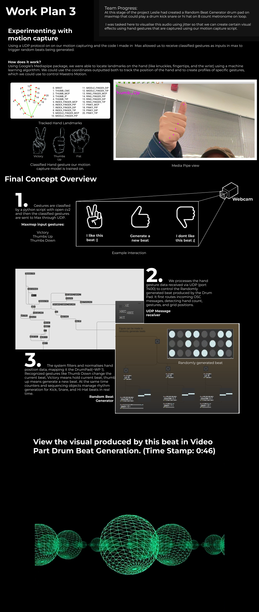

# 🎵 AXD Digital Report: Motion-Controlled Audio Interaction

**Project for the Audio Experience Design (AXD) module at Dyson School of Design Engineering.**  
This project explores **gesture-controlled music interaction** using **MediaPipe, OpenCV, Max/MSP, and UDP communication**.  
Users can **toggle instruments, generate drum beats, and interact with music** using **hand-tracking-based gestures**.

---




## Work Plan Breakdown  

### **Work Plan 1: Gesture-Based Instrument Control**  
**Files used:**  
- `hand_recognition.py` (Python script for hand tracking & UDP communication)  
- **Intel OpenVino Music segmentation Plugin**  
- **Max/MSP Patch for Gesture-Based Audio Toggling**  
- **After Effects 3D Visualizer**  

**Overview:**  
- The **goal** was to explore **motion capture-based interaction** in an **orchestral performance**.  
- Users can **toggle instrument segments** (Drums, Bass, Rest) using **hand gestures**.  
- The **MediaPipe & OpenCV** script tracks hand movements and sends data via **UDP** to **Max/MSP**.  
- **Max/MSP handles real-time audio toggling**, while **After Effects** generates **3D waveform visuals**.

### ✋**Hand Gesture Controls:**
| Gesture | Function |
|---------|-------------|
| ✌️ Two Fingers (5 sec) | Toggle Rest Mode |
| 👍 Thumbs Up (5 sec) | Toggle Drums On/Off |
| ✊ Fist (5 sec) | Toggle Bass On/Off |

**[View Work Plan 1 Figma](./A4-2.png)**  

---

### **Work Plan 2: Interactive Drum Pad Using Gestures**  
**Relevant Files:**  
- `MaxMSP DrumPad Patch`  
- `hand_recognition.py` (Hand tracking updates for beat triggering)  
- **Gesture-Based Drum Sequencing Algorithm**  

**Overview:**  
- Built a **gesture-controlled DrumPad** where **users can play drum beats** using **hand movements**.  
- Each **drum component (Kick, Snare, Hi-Hat)** is mapped to **grid positions** using **hand tracking**.  
- Used **Max/MSP Jitter** to **visualize** real-time drum sequences.  

### 🥁 **Beat Mapping:**
| Gesture | Drum Component |
|---------|---------------|
| ✊ Fist | Kick Drum (Activated when moving) |
| ✌️ Victory | Snare Drum (Triggered when hands are still) |
| ✋ Open Palm | Hi-Hat (Beeps with Metronome) |

**[View Work Plan 2 Figma](./A4-5.png)**  

---

###**Work Plan 3: Gesture-Based Generative Drum Beat**  
**Relevant Files:**  
- `hand_recognition.py` (Final Gesture-Integrated Version)  
- `MaxMSP Grid-Based Beat Sequencer`  
- **UDP Integration for Gesture Triggering**  

**Overview:**  
- **Upgraded** the motion capture system to control a **generated drum beat** via **hand gestures**.  
- Implemented a **GridSpace system**, mapping drum components to a **spatial hand-tracking matrix**.  
- UDP communication **sends gestures to Max/MSP**, triggering unique drum sequences.

### 🎼 **Grid-Based Mapping:**
| Row | Drum Component |
|-----|--------------|
| **1** | Kick |
| **2** | Snare |
| **3** | Hi-Hat |

**[View Work Plan 3 Figma](./A4-6.png)**  

---

## 🔹 **Final Code Implementation**  
**📂 Final Files:**  
- `hand_recognition.py` (Final Optimized Code)  
- `MaxMSP Interactive Beat System`  
- **Full Gesture-Based Interaction Patch**  

### **Final Concept Summary**  
✅ Integrated **gesture-based drum sequencing and instrument toggling** into a **real-time performance system**.  
✅ **Final prototype** allows **users to interact dynamically with music** using only **hand gestures**.  
✅ Combines **computer vision, AI-driven gesture recognition, and Max/MSP audio manipulation**.  

📎 **[View Final Work Plan Figma](./A4-7.png)**  

---

## **🛠️ How to Run the Project**
### **1️⃣ Install Dependencies**
Ensure Python is installed (recommended: **Python 3.7 - 3.10**). Then install the necessary libraries:

```bash
pip install mediapipe opencv-python python-osc
